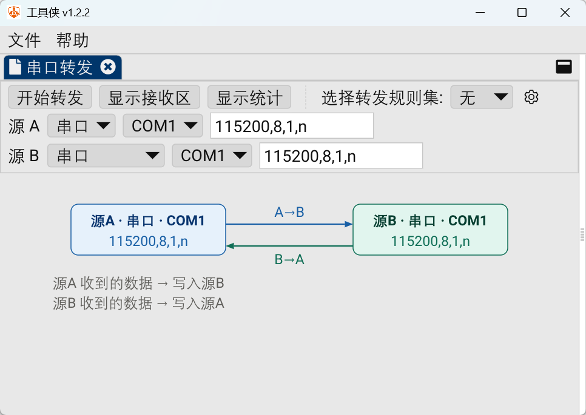
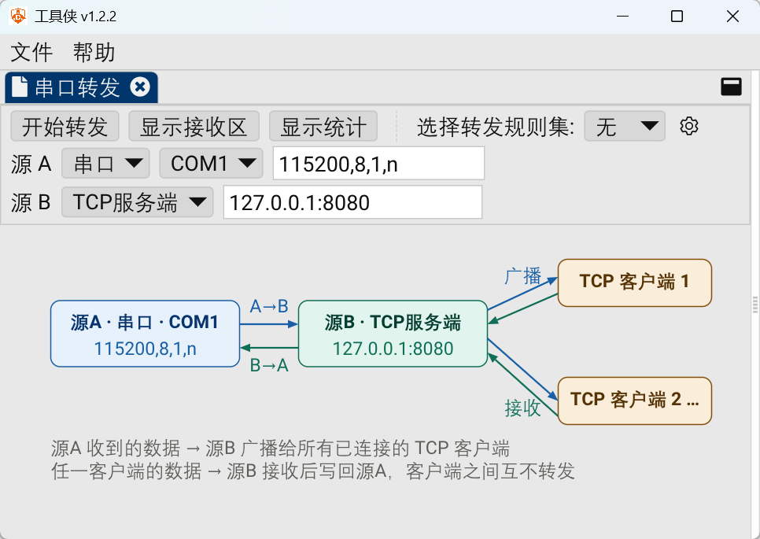
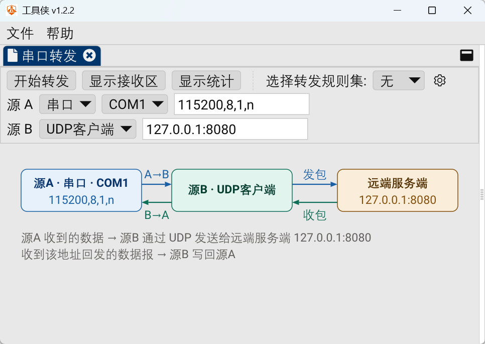
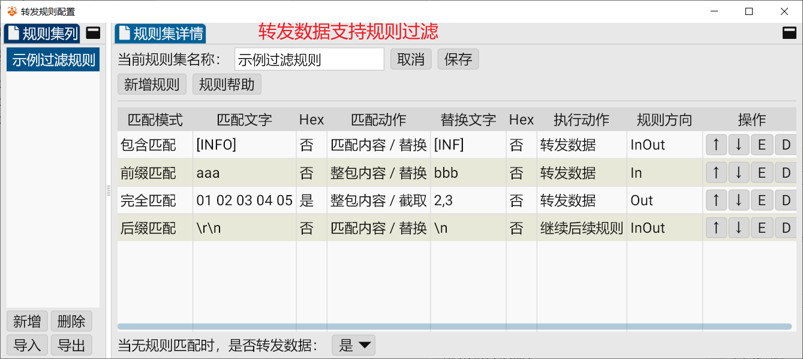

> 在嵌入式开发、工控调试、物联网网关等场景里，我们常常需要把一路串口的数据"搬"到另一路串口、或者搬到一个网络端口上。例如：
>
> - 把一台老设备的 **RS232 串口** 实时映射成 **TCP 端口**，让远程电脑上的上位机直接连；
> - 把 **串口 A** 收到的数据原样转发到 **串口 B**，临时搭一个"串口软延长线"；
> - 把下位机的串口报文通过 **UDP** 扔给一个日志服务器。
>
>「串口转发」页面就是为此而生的一体化工具：它把**两个数据源（源 A、源 B）** 双向打通，任何一端收到的数据都会实时写进另一端。两端可以是串口，也可以是 TCP/UDP 网络端点，组合出多种转发方式。

---

## 一、串口转串口（串口 ↔ 串口）

最经典的用法：把一路串口收到的数据原样写到另一路串口，两端完全对等、双向互通。

### 配置步骤
1. **源 A** → 类型选「串口」：
   - 「串口号」下拉框会**自动枚举本机可用串口**（如 `COM3`、`COM5`）。插入/拔出设备后重新展开下拉即可刷新。
   - 「串口配置」填写 `波特率,数据位,停止位,校验位`，例如 `115200,8,1,n`。
     - 波特率：如 `9600`、`115200`；
     - 数据位：`5`，`6`，`7` 或 `8`；
     - 停止位：`1`、`1.5` 或 `2`；
     - 校验位：`n`(无)/`o`(奇)/`e`(偶)。
2. **源 B** → 类型同样选「串口」，串口号与配置按第二台设备填写（可与源 A 不同参数）。
3. 点击 **开始转发**。

### 典型场景
- 临时延长串口线（两台机器各插一路串口，中间用本软件桥接）；
- 把带校验位的老设备数据转发到不带校验位的新设备做兼容测试；
- 同时打开多个转发标签页，分别桥接多对串口设备。

---

## 二、串口转 TCP

把串口数据推到网络上，让上位机/远端通过 TCP 访问。源 B 有两种形态，按需选择：

### 2.1 源 B = TCP 客户端（主动连远端服务端）
适用于：本地串口要连到一个**已经存在的 TCP 服务端**（如远程上位机正在监听 `192.168.1.100:8080`）。

配置：
- 源 A：串口（参同上）。
- 源 B：类型选「**TCP 客户端**」，地址填 `远端服务端ip:port`，例如 `192.168.1.100:8080`。

### 2.2 源 B = TCP 服务端（本机监听，向所有客户端广播）
适用于：你想把串口数据**广播**给多台上位机，或让多个客户端都能向串口下发指令。

配置：
- 源 A：串口（参同上）。
- 源 B：类型选「**TCP 服务端**」，地址填 `本机监听ip:port`，例如 `0.0.0.0:8080`（或 `127.0.0.1:8080` 仅本机）。

> 注意：TCP 服务端模式下，某个客户端断开连接**不会**终止整个转发；只有当监听本身失效才会停止。

### 典型场景
- 串口设备联网化：把秤、仪表、PLC 的串口数据变成 TCP 流，供 SCADA/上位机采集；
- 多上位机同时监控同一台串口设备（用 TCP 服务端广播模式）。

---

## 三、串口转 UDP

把串口数据以 UDP 数据报形式发给远端，并从该地址收回发的数据报。

配置：
- 源 A：串口（参同上）。
- 源 B：类型选「**UDP 客户端**」，地址填 `远端udp端ip:port`，例如 `192.168.1.100:9000`。

> UDP 是无连接协议：源 B 会记住最近一次通信的对端地址，把远端回发的数据报写回源 A。适合对实时性要求高、可容忍少量丢包的场景（如广播式日志、局域网设备发现）。

### 典型场景
- 把串口日志以 UDP 甩到日志收集服务；
- 局域网内向 UDP 设备透传串口指令并收回显。

---

## 通用操作与说明

### 开始 / 停止
- 点击 **开始转发** 同时打开源 A 与源 B 并接通双向通道，按钮变为 **停止转发**。
- 点击 **停止转发** 断开两端、复位计数，并重新放开源 A / 源 B 的配置项（转发中配置被锁定，避免误改）。
- 若某端**意外断开**（非手动停止），软件会弹窗提示「连接断开」并自动停止转发，防止对话框刷屏卡顿。

### 接收区与统计
- **显示接收区 / 隐藏接收区**：切换底部的「转发数据显示区」。
- 接收区右侧选项：
  - **显示数据**：在显示区打印转发内容；
  - **保存文件**：勾选后选择 `.txt/.log` 落盘（追加写入）；
  - **十六进制**：以 `XX XX XX` 形式展示；
  - **接收时间**：每行加 `HH:MM:SS.mmm` 时间戳；
  - **自动换行**：默认勾选，按报文换行；
  - **显示长度**：标注每条报文字节数；
  - **清空数据**：清空显示区并重置计数。
- **显示统计 / 隐藏统计**：在控制面板显示 `转发次数|字节数(A->B: n|m, B->A: n|m)`，用于核对两端收发量。

---

## 进阶：转发规则（可选）

顶部「选择转发规则集」下拉 + 「⚙」配置按钮，可挂接一套**转发规则集**，对双向数据做匹配与处理后再转发：

- **方向**：规则可作用于 `In`（源A→源B）、`Out`（源B→源A）、`InOut`（双向）。
- **匹配**：前缀 / 后缀 / 完全 / 包含 / 正则；支持文本或十六进制（`Hex`）。
- **处理**：替换、删除、截取（截取支持 `start,end`，负数表示从末尾倒数）。
- **动作**：转发数据（命中即转发并停止）、丢弃数据（命中即丢弃）、继续后续规则（链式处理）。
- 未命中任何规则时，按规则集的「默认转发」开关决定放行或丢弃。

例：只想把含关键字 `ERROR` 的报文透传、其余丢弃——可设一条「包含匹配 `ERROR` → 转发数据」，并把默认转发关掉。

---

## 小结

| 目标 | 源 A | 源 B | 一句话 |
|------|------|------|--------|
| 串口转串口 | 串口 | 串口 | 两路串口点对点双向桥接 |
| 串口转 TCP（连远端） | 串口 | TCP 客户端 | 串口数据主动推给远端 TCP 服务端 |
| 串口转 TCP（被连） | 串口 | TCP 服务端 | 本机监听，串口数据广播给所有 TCP 客户端 |
| 串口转 UDP | 串口 | UDP 客户端 | 串口数据以 UDP 数据报收发 |

---

## 最后

如果有任何软件使用方面的问题或建议，可扫码添加作者联系方式：

